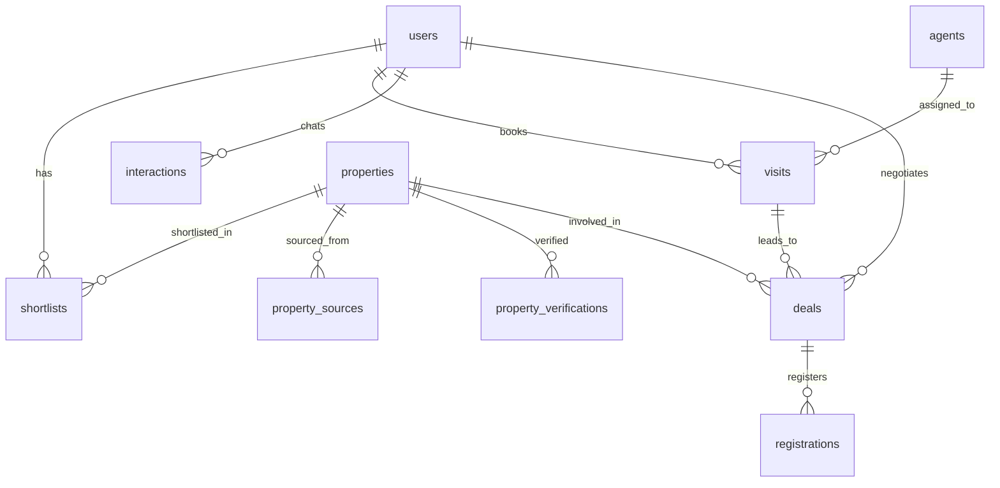

# Database Reference

This document describes the SQLAlchemy data model and how each table is queried in the Real Estate Broker application.

## Overview

- **ORM:** SQLAlchemy (`app/models.py`)
- **Session:** `SessionLocal` / `get_db()` in `app/database.py`
- **Default database:** SQLite at `sqlite:///./real_estate.db` (configured via `DATABASE_URL` in `.env`)
- **Schema creation:** `ensure_database_schema()` runs on app startup and applies lightweight migrations for `properties` columns



---

## Tables

### 1. `users`

One row per WhatsApp or Gradio chat user.

| Column | Type | Notes |
|--------|------|-------|
| `user_id` | PK (UUID string) | Auto-generated |
| `phone_number` | string, unique, indexed | Primary lookup key |
| `name` | string | Default `"Customer"` |
| `preferences` | JSON | e.g. `{location, budget, bhk, type}` |

**Service:** `app/services/agent_service.py`, `app/services/broker_agent.py`

**SQLAlchemy examples**

```python
from app.database import SessionLocal
from app.models import User

db = SessionLocal()

# Find by phone (upsert pattern)
user = db.query(User).filter(User.phone_number == phone_number).first()

# Create new user
user = User(phone_number=phone_number, name="WhatsApp User", preferences={})
db.add(user)
db.commit()

# Update preferences after message processing
user.preferences = {"location": "thane", "budget": 25000, "bhk": 2, "type": "rent"}
db.commit()
```

**Raw SQL**

```sql
SELECT * FROM users WHERE phone_number = '+919702044168';
SELECT user_id, preferences FROM users WHERE user_id = '...';
```

---

### 2. `properties`

Listing inventory: seed data, web-scraped listings, and owner uploads.

| Column | Type | Notes |
|--------|------|-------|
| `property_id` | PK (UUID) | |
| `title` | string | |
| `location` | string, indexed | Normalized on ingest |
| `price` | float | |
| `bhk` | integer | |
| `type` | string | `rent` or `buy` |
| `source` | string | e.g. `internal`, `housing.com` |
| `owner_contact` | string | |
| `status` | string | `active`, `inactive`, `needs_review` |
| `freshness_score` | float | Recency / verification weight |
| `fitness_score` | float | Data completeness weight |
| `verification_status` | string | `verified` or `unverified` |
| `listing_url` | string | External listing URL |
| `photo_storage_folder` | string | Cloud storage path |
| `canonical_key` | string, indexed | Dedup key: `title\|location\|bhk\|type` |
| `last_seen_at` | datetime | Last inventory refresh |
| `last_verified_at` | datetime, nullable | |
| `metadata` | JSON | Amenities, image URLs, snippets, etc. |

**Services:** `property_service.py`, `inventory_service.py`, `web_property_service.py`, `owner_listing_service.py`

**SQLAlchemy examples**

```python
from app.models import Property

# Search candidates (ranking done in Python)
rows = (
    db.query(Property)
    .filter(Property.type == "rent")
    .filter(Property.bhk == 2)
    .all()
)

# Resolve partial property ID (first 8+ hex chars from user message)
matches = db.query(Property).filter(Property.property_id.startswith(ref)).all()

# Dedup on inventory ingest
db.query(Property).filter(Property.canonical_key == canonical_key).first()
db.query(Property).filter(Property.listing_url == listing_url).first()

# Bulk fetch for visits / deals
db.query(Property).filter(Property.property_id.in_(property_ids)).all()

# Mark stale listings inactive
db.query(Property).filter(Property.source == source_name).filter(
    Property.location.contains(location)
).all()
```

**Raw SQL**

```sql
SELECT * FROM properties
WHERE type = 'rent' AND bhk = 2 AND location LIKE '%thane%';

SELECT * FROM properties WHERE property_id LIKE 'a1b2c3d4%';

SELECT property_id, title, location, price, verification_status
FROM properties
WHERE status = 'active'
ORDER BY freshness_score DESC
LIMIT 10;
```

---

### 3. `shortlists`

Links users to properties they have saved.

| Column | Type | Notes |
|--------|------|-------|
| `id` | PK (UUID) | |
| `user_id` | FK → `users.user_id`, indexed | |
| `property_id` | FK → `properties.property_id`, indexed | |
| `status` | string | Default `shortlisted` |

**Services:** `property_service.py`, `history_service.py`

**SQLAlchemy examples**

```python
from app.models import Shortlist, Property

# Check existing shortlist (upsert)
row = (
    db.query(Shortlist)
    .filter(Shortlist.user_id == user_id)
    .filter(Shortlist.property_id == property_id)
    .first()
)

# Join to get full property details for a user
properties = (
    db.query(Property)
    .join(Shortlist, Shortlist.property_id == Property.property_id)
    .filter(Shortlist.user_id == user_id)
    .filter(Shortlist.status == "shortlisted")
    .all()
)
```

**Raw SQL**

```sql
SELECT p.*
FROM properties p
JOIN shortlists s ON s.property_id = p.property_id
WHERE s.user_id = '...' AND s.status = 'shortlisted';
```

---

### 4. `visits`

Scheduled property walkthroughs.

| Column | Type | Notes |
|--------|------|-------|
| `visit_id` | PK (UUID) | |
| `user_id` | FK → `users.user_id`, indexed | |
| `property_ids` | text | Comma-separated property IDs |
| `scheduled_time` | datetime | |
| `status` | string | `scheduled`, then `assigned` |
| `assigned_agent_id` | FK → `agents.agent_id` | Set when agent is assigned |

**Services:** `scheduler_service.py`, `agent_assignment.py`

**SQLAlchemy examples**

```python
from app.models import Visit

# Create visit
visit = Visit(
    user_id=user_id,
    property_ids=",".join(property_ids),
    scheduled_time=preferred_time,
    status="scheduled",
    assigned_agent_id="",
)
db.add(visit)
db.commit()

# Load for agent assignment
visit = db.query(Visit).filter(Visit.visit_id == visit_id).first()
```

**Raw SQL**

```sql
SELECT * FROM visits WHERE user_id = '...' ORDER BY scheduled_time DESC;
SELECT * FROM visits WHERE status = 'scheduled';
```

---

### 5. `agents`

Field agents available for visit assignment.

| Column | Type | Notes |
|--------|------|-------|
| `agent_id` | PK (UUID) | |
| `name` | string | Seeded from `FIELD_AGENT_NAME` |
| `phone` | string | Seeded from `FIELD_AGENT_PHONE` |
| `availability` | string | `available` or `busy` |
| `location` | string | e.g. `thane` |

**Services:** `agent_assignment.py`, `main.py` (seed)

**SQLAlchemy examples**

```python
from app.models import Agent

# Pick first available agent
agent = db.query(Agent).filter(Agent.availability == "available").first()

# Seed check on startup
count = db.query(Agent).count()
```

**Raw SQL**

```sql
SELECT * FROM agents WHERE availability = 'available';
```

---

### 6. `interactions`

Conversational history between user and assistant.

| Column | Type | Notes |
|--------|------|-------|
| `interaction_id` | PK (UUID) | |
| `user_id` | FK → `users.user_id`, indexed | |
| `role` | string | `user` or `assistant` |
| `message` | text | |
| `metadata` | JSON | Optional extras |
| `created_at` | datetime | Default UTC now |

**Service:** `history_service.py`

**SQLAlchemy examples**

```python
from app.models import Interaction

# Save a message
db.add(Interaction(user_id=user_id, role="user", message=message, metadata_json={}))
db.commit()

# Recent history for LLM context (last 12, returned chronological)
rows = (
    db.query(Interaction)
    .filter(Interaction.user_id == user_id)
    .order_by(Interaction.created_at.desc())
    .limit(12)
    .all()
)
```

**Raw SQL**

```sql
SELECT role, message, created_at
FROM interactions
WHERE user_id = '...'
ORDER BY created_at DESC
LIMIT 12;
```

---

### 7. `property_sources`

Tracks external sources and ingest payloads for each property.

| Column | Type | Notes |
|--------|------|-------|
| `source_id` | PK (UUID) | |
| `property_id` | FK → `properties.property_id`, indexed | |
| `source_name` | string | e.g. `housing.com` |
| `source_type` | string | e.g. `feed` |
| `external_listing_id` | string, indexed | |
| `source_url` | string | |
| `fingerprint` | string, indexed | SHA256 dedup key |
| `payload` | JSON | Raw ingest metadata |
| `ingested_at` | datetime | |

**Service:** `inventory_service.py`

**SQLAlchemy examples**

```python
from app.models import PropertySource

source_row = (
    db.query(PropertySource)
    .filter(PropertySource.property_id == property_id)
    .filter(PropertySource.fingerprint == fingerprint)
    .first()
)
```

**Raw SQL**

```sql
SELECT * FROM property_sources WHERE property_id = '...';
SELECT * FROM property_sources WHERE source_name = 'housing.com';
```

---

### 8. `property_verifications`

Audit log when a listing is verified or reviewed.

| Column | Type | Notes |
|--------|------|-------|
| `verification_id` | PK (UUID) | |
| `property_id` | FK → `properties.property_id`, indexed | |
| `status` | string | e.g. `verified` |
| `notes` | text | |
| `verified_by` | string | e.g. `system`, `inventory_refresh` |
| `verified_at` | datetime | |

**Service:** `inventory_service.py`

**SQLAlchemy examples**

```python
from app.models import PropertyVerification

db.add(PropertyVerification(
    property_id=property_id,
    status="verified",
    notes="Verified during inventory refresh",
    verified_by="inventory_refresh",
))
db.commit()
```

**Raw SQL**

```sql
SELECT * FROM property_verifications
WHERE property_id = '...'
ORDER BY verified_at DESC;
```

---

### 9. `deals`

Negotiation pipeline from discovery through closing.

| Column | Type | Notes |
|--------|------|-------|
| `deal_id` | PK (UUID) | |
| `user_id` | FK → `users.user_id`, indexed | |
| `property_id` | FK → `properties.property_id`, indexed | |
| `visit_id` | FK → `visits.visit_id` | Optional |
| `stage` | string | `discovery`, `negotiation`, `closed`, etc. |
| `status` | string | `open` or `closed` |
| `offered_price` | float, nullable | |
| `final_price` | float, nullable | |
| `agreement_path` | string | Local PDF path |
| `notes` | text | |
| `created_at` | datetime | |
| `updated_at` | datetime | |

**Service:** `deal_service.py`

**SQLAlchemy examples**

```python
from app.models import Deal

# Get open deal for user + property
deal = (
    db.query(Deal)
    .filter(Deal.user_id == user_id)
    .filter(Deal.property_id == property_id)
    .filter(Deal.status == "open")
    .first()
)

# Advance deal stage
deal = db.query(Deal).filter(Deal.deal_id == deal_id).first()
deal.stage = "negotiation"
deal.offered_price = 24000
db.commit()
```

**Raw SQL**

```sql
SELECT * FROM deals WHERE user_id = '...' AND status = 'open';
SELECT * FROM deals WHERE property_id = '...' ORDER BY updated_at DESC;
```

---

### 10. `registrations`

Agreement and sub-registrar scheduling after a deal progresses.

| Column | Type | Notes |
|--------|------|-------|
| `registration_id` | PK (UUID) | |
| `deal_id` | FK → `deals.deal_id`, indexed | |
| `status` | string | `initiated`, `scheduled` |
| `agreement_type` | string | `rent` or `buy_sell` |
| `agreement_path` | string | PDF path |
| `office_location` | string | |
| `scheduled_date` | datetime, nullable | |
| `created_at` | datetime | |

**Service:** `deal_service.py`

**SQLAlchemy examples**

```python
from app.models import Registration

registration = (
    db.query(Registration)
    .filter(Registration.deal_id == deal_id)
    .filter(Registration.status.in_(["initiated", "scheduled"]))
    .first()
)
```

**Raw SQL**

```sql
SELECT * FROM registrations WHERE deal_id = '...';
SELECT * FROM registrations WHERE status = 'scheduled';
```

---

## Message flow through tables

Typical path when a user sends a chat message:

1. **Upsert user** → `users` (by `phone_number`)
2. **Save user message** → `interactions`
3. **Extract preferences** → update `users.preferences`
4. **Search properties** → query `properties`, rank in memory
5. **Shortlist** → insert/update `shortlists`
6. **Schedule visit** → insert `visits`, then query `agents` and update visit
7. **Negotiate** → upsert/advance `deals`
8. **Agreement / registration** → insert/update `registrations`
9. **Save assistant reply** → `interactions`

Inventory refresh (background / script) additionally writes to `properties`, `property_sources`, and `property_verifications`.

---

## Service → table map

| Service | Tables |
|---------|--------|
| `agent_service.py` | `users`, `interactions` |
| `broker_agent.py` | `users`, `properties`, `shortlists`, `visits`, `deals` |
| `property_service.py` | `properties`, `shortlists` |
| `history_service.py` | `interactions`, `shortlists` (+ join `properties`) |
| `scheduler_service.py` | `visits` |
| `agent_assignment.py` | `visits`, `agents` |
| `deal_service.py` | `deals`, `registrations` |
| `inventory_service.py` | `properties`, `property_sources`, `property_verifications` |
| `main.py` | `properties`, `agents` (seed on startup) |

---

## Querying locally

### Python shell

```bash
source .venv/bin/activate
python -c "
from app.database import SessionLocal
from app.models import User, Property, Shortlist, Interaction, Visit, Deal

db = SessionLocal()
print('Users:', db.query(User).count())
print('Properties:', db.query(Property).count())
print('Shortlists:', db.query(Shortlist).count())
print('Interactions:', db.query(Interaction).count())
print('Visits:', db.query(Visit).count())
print('Deals:', db.query(Deal).count())
db.close()
"
```

### SQLite CLI

```bash
sqlite3 real_estate.db

.tables
.schema users
.schema properties

SELECT property_id, title, location, price, type FROM properties LIMIT 5;
SELECT phone_number, preferences FROM users;
```

### Via API (no direct DB access)

```bash
curl -X POST http://127.0.0.1:8000/simulate-message \
  -H "Content-Type: application/json" \
  -d '{"phone_number": "+919999999999", "message": "2bhk for rent in thane under 25k"}'
```

---

## Related files

| File | Purpose |
|------|---------|
| `app/models.py` | SQLAlchemy model definitions |
| `app/database.py` | Engine, session, schema migration |
| `app/schemas.py` | Pydantic input/output for search, visits, etc. |
| `app/config.py` | `DATABASE_URL` and other settings |
| `.env.example` | Example `DATABASE_URL` value |
